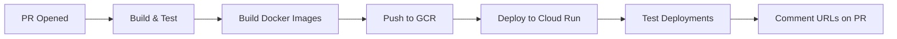

# 🌟 Ratings & Reviews Microfrontend POC

A proof-of-concept monorepo for a ratings and reviews system built with microfrontend architecture on Google Cloud Platform, designed to stay within GCP free tier limits.

## 🏗️ Architecture Overview

This POC uses a **monorepo structure** with the following components:

```
├── backend/          # Node.js/TypeScript API service
├── frontend/         # Static frontend application  
├── infra/           # Terraform infrastructure as code
├── scripts/         # Deployment and troubleshooting utilities
├── .github/         # CI/CD workflows
└── docs/            # Additional documentation
```

### Technology Stack

- **Backend**: Node.js 18 + TypeScript + Express
- **Frontend**: Vanilla HTML/CSS/JS (static serving)
- **Infrastructure**: Google Cloud Run (backend & frontend)
- **CI/CD**: GitHub Actions
- **IaC**: Terraform
- **Container Registry**: Google Container Registry (GCR)
- **Secrets**: Google Secret Manager

## 🚀 Quick Start

### Prerequisites

1. **Google Cloud Account** with billing enabled (free tier)
2. **GitHub Repository** with the following secrets:
   - `GCP_SA_KEY`: Service Account JSON key with Cloud Run permissions
   - `GCP_PROJECT_ID`: Your GCP project ID (optional, defaults to `ratings-reviews-poc`)

### Local Development

1. **Clone the repository**:
   ```bash
   git clone <repository-url>
   cd POC-Rating-and-review-CommerceTools
   ```

2. **Backend development**:
   ```bash
   cd backend
   npm install
   npm run dev  # Starts on http://localhost:8080
   ```

3. **Frontend development**:
   ```bash
   cd frontend
   npm install
   npm run dev  # Starts on http://localhost:8080
   ```

### Production Deployment via CI/CD

1. **Create a Pull Request**: Every PR automatically triggers deployment of preview environments
2. **Review URLs**: GitHub bot comments with frontend and backend URLs
3. **Auto-cleanup**: Preview environments are automatically deleted when PR is closed

## 🔄 CI/CD Workflow

### PR Preview Flow



### Environment Naming Convention

- **Format**: `pr-{PR_NUMBER}-{BRANCH_NAME}`
- **Services**: 
  - Backend: `ratings-reviews-backend-pr-123-feature-branch`
  - Frontend: `ratings-reviews-frontend-pr-123-feature-branch`

## 🏛️ Infrastructure

### Cloud Services Used (Free Tier Only)

| Service | Usage | Free Tier Limits |
|---------|-------|------------------|
| **Cloud Run** | Backend & Frontend hosting | 2M requests/month, 400,000 GB-seconds |
| **Container Registry** | Docker image storage | 0.5GB storage |
| **Secret Manager** | Environment secrets | 6 active secrets |

### Service Configuration

- **CPU**: 1 vCPU per service
- **Memory**: 512Mi per service  
- **Concurrency**: 80 requests per instance
- **Min Instances**: 0 (scales to zero)
- **Max Instances**: 10
- **Timeout**: 300 seconds

## 📁 Directory Structure

```
POC-Rating-and-review-CommerceTools/
│
├── 📁 backend/                 # Backend API Service
│   ├── 📄 package.json         # Node.js dependencies
│   ├── 📄 tsconfig.json        # TypeScript configuration
│   ├── 📄 Dockerfile           # Container configuration
│   └── 📁 src/
│       └── 📄 server.ts        # Express server with health checks
│
├── 📁 frontend/                # Frontend Static Service  
│   ├── 📄 package.json         # Node.js dependencies
│   ├── 📄 server.js            # Static file server
│   ├── 📄 Dockerfile           # Container configuration
│   └── 📁 public/
│       └── 📄 index.html       # Main application page
│
├── 📁 infra/                   # Infrastructure as Code
│   ├── 📄 main.tf              # Terraform main configuration
│   ├── 📄 variables.tf         # Input variables
│   └── 📄 outputs.tf           # Output values
│
├── 📁 .github/workflows/       # CI/CD Automation
│   ├── 📄 pr-preview.yml       # PR preview deployment
│   └── 📄 pr-cleanup.yml       # Preview environment cleanup
│
├── 📁 scripts/                 # Utility Scripts
│   └── 📄 troubleshoot.sh      # Troubleshooting utility
│
└── 📄 README.md               # This file
```

## 🔧 Configuration

### Environment Variables

#### Backend Service
- `PORT`: Server port (default: 8080)
- `NODE_ENV`: Environment (dev/preview/prod)
- `API_KEY`: External API key (from Secret Manager)

#### Frontend Service  
- `PORT`: Server port (default: 8080)
- `NODE_ENV`: Environment (dev/preview/prod)
- `BACKEND_URL`: Backend service URL (auto-configured)

### GitHub Repository Secrets

Required secrets for CI/CD:

| Secret | Description | Required |
|--------|-------------|----------|
| `GCP_SA_KEY` | Service Account JSON key | ✅ Yes |
| `GCP_PROJECT_ID` | Google Cloud Project ID | ⚪ Optional |

## 🧪 Testing

### Health Checks

Both services include health check endpoints:
- Backend: `GET /health`
- Frontend: `GET /health`

### API Testing

Backend API endpoints:
- `GET /api/ratings` - List ratings
- `POST /api/ratings` - Create rating

### Manual Testing

Use the troubleshooting script:
```bash
./scripts/troubleshoot.sh [env_name] [project_id] [region]
```

## 🔍 Monitoring & Troubleshooting

### Common Issues & Solutions

1. **Build Failures**
   ```bash
   # Check GitHub Actions logs
   # Verify Node.js version compatibility
   # Check package.json dependencies
   ```

2. **Deployment Failures**  
   ```bash
   # Run troubleshooting script
   ./scripts/troubleshoot.sh
   
   # Check service account permissions
   gcloud projects get-iam-policy PROJECT_ID
   ```

3. **Service Not Accessible**
   ```bash
   # Check service status
   gcloud run services list --region=us-central1
   
   # View service logs
   gcloud logs read --service=SERVICE_NAME
   ```

### Useful Commands

```bash
# List all Cloud Run services
gcloud run services list --region=us-central1

# View service logs  
gcloud logs read --service=ratings-reviews-backend-dev

# Delete a service
gcloud run services delete SERVICE_NAME --region=us-central1

# List container images
gcloud container images list --repository=gcr.io/PROJECT_ID
```

## 💰 Budget & Quotas (POC Constraints)

### Cost Optimization Strategy

This POC is designed to **stay within GCP free tier limits**:

- ✅ **No CDN** (Cloud CDN costs apply)
- ✅ **No Load Balancer** (uses Cloud Run direct URLs)  
- ✅ **No Cloud Armor** (free tier doesn't include it)
- ✅ **No MemoryStore** (Redis costs apply)
- ✅ **Scales to zero** (no idle costs)

### Free Tier Monitoring

| Resource | Free Tier Limit | Monitoring |
|----------|-----------------|------------|
| Cloud Run requests | 2M/month | GitHub Actions logs |
| Cloud Run GB-seconds | 400,000/month | GCP Console |
| Container Registry | 0.5GB storage | `gcloud container images list` |
| Secret Manager | 6 active secrets | `gcloud secrets list` |

## 🚦 Limits & Production Considerations

### POC Limitations

⚠️ **This is a POC setup** with intentional limitations:

1. **No Custom Domain**: Uses Cloud Run URLs
2. **No CDN**: Static assets served directly from Cloud Run
3. **No Database**: Uses mock data
4. **No Authentication**: Public endpoints
5. **No Load Testing**: Not optimized for high traffic
6. **No Monitoring**: Basic health checks only

### Production Migration Path

For production deployment, consider:

1. **Custom Domain + SSL** (Cloud DNS + Certificate Manager)
2. **CDN Integration** (Cloud CDN for static assets)
3. **Database** (Cloud Firestore/Cloud SQL)
4. **Authentication** (Firebase Auth/Identity Platform)
5. **API Security** (Cloud Armor + API Gateway)
6. **Monitoring** (Cloud Monitoring + Error Reporting)
7. **Load Balancing** (Cloud Load Balancer)

## 🤝 Contributing

### Development Workflow

1. Create feature branch from `main`
2. Develop locally using `npm run dev`
3. Create Pull Request
4. Review deployment URLs posted by CI/CD bot
5. Merge after approval (preview environments auto-cleanup)

### Code Standards

- **TypeScript** for backend code
- **ESLint** for code linting
- **Health checks** required for all services
- **Docker** multi-stage builds for optimization
- **Semantic versioning** for releases

## 📖 Additional Documentation

- [Infrastructure Documentation](./infra/README.md)
- [Backend API Documentation](./backend/README.md)
- [Frontend Documentation](./frontend/README.md)
- [Troubleshooting Guide](./scripts/README.md)

## 🆘 Support

### Getting Help

1. **Check troubleshooting script**: `./scripts/troubleshoot.sh`
2. **Review GitHub Actions logs**: Check workflow runs
3. **Check Cloud Run logs**: `gcloud logs read --service=SERVICE_NAME`
4. **Verify GCP quotas**: GCP Console → IAM & Admin → Quotas

### Contact

For questions about this POC setup, please:
- Create an issue in this repository
- Check existing documentation in `/docs`
- Review the troubleshooting guide

---

**⚡ Ready to deploy?** Just open a Pull Request and watch the magic happen! 🎉