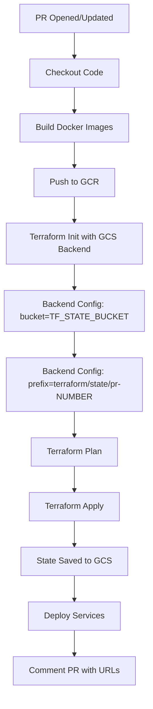
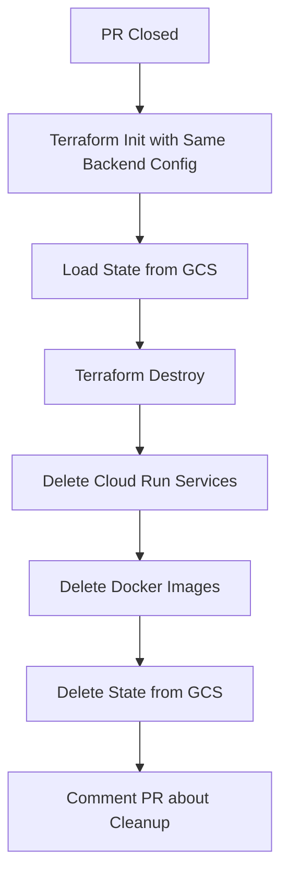

# Terraform State Management with GCS Backend

## Overview

This document explains how the GCS backend is configured for Terraform state management in the CI/CD workflows.

## Architecture

### State Storage Structure

```
gs://your-terraform-state-bucket/
└── terraform/
    └── state/
        ├── pr-123/                    # PR #123 state
        │   ├── default.tfstate
        │   └── default.tfstate.backup
        ├── pr-456/                    # PR #456 state
        │   ├── default.tfstate
        │   └── default.tfstate.backup
        ├── local/                     # Local development state
        │   └── default.tfstate
        └── prod/                      # Production state (if used)
            └── default.tfstate
```

### Workflow Flow

#### PR Preview Deployment (pr-preview.yml)



#### PR Cleanup (pr-cleanup.yml)



## Configuration Details

### Backend Configuration File

The `backend-config.tf` file defines the GCS backend:

```hcl
terraform {
  backend "gcs" {
    # Configured via -backend-config flags during terraform init
  }
}
```

### Workflow Configuration

In both workflows, Terraform is initialized with:

```yaml
- name: Terraform Init
  run: |
    cd infra
    terraform init \
      -backend-config="bucket=${{ secrets.TF_STATE_BUCKET || vars.TF_STATE_BUCKET }}" \
      -backend-config="prefix=terraform/state/pr-${{ github.event.pull_request.number }}"
```

**Key Points:**
- `bucket`: Can be set as either a Secret or Variable in GitHub
- `prefix`: Automatically generated per PR to isolate state
- Same configuration used in both preview and cleanup workflows

### State Lifecycle

1. **PR Opened**: 
   - State file created: `gs://bucket/terraform/state/pr-123/default.tfstate`
   - Empty state (no resources yet)

2. **Terraform Apply**: 
   - Resources created and tracked in state
   - State includes: Cloud Run services, IAM bindings, etc.

3. **PR Updated (New Commit)**:
   - Same state file loaded: `gs://bucket/terraform/state/pr-123/default.tfstate`
   - Terraform knows about existing resources
   - Only applies changes (no duplicates)

4. **PR Closed**:
   - State loaded for destroy operation
   - Resources properly removed
   - State file deleted from GCS

## Benefits

### ✅ Problem Solved: Resource Duplication

**Before (Local State):**
```
Commit 1: terraform apply → Creates services (state lost)
Commit 2: terraform apply → Tries to create same services → ERROR
```

**After (GCS Backend):**
```
Commit 1: terraform apply → Creates services (state in GCS)
Commit 2: terraform apply → Loads state → Updates services ✓
```

### ✅ Problem Solved: Cleanup Failure

**Before (Local State):**
```
PR Closed: terraform destroy → No state found → Services remain
Fallback: Manual gcloud delete required
```

**After (GCS Backend):**
```
PR Closed: terraform destroy → Loads state from GCS → Removes all resources ✓
Cleanup: State deleted from GCS
```

## Local Development

For local Terraform operations:

### Initialize with Backend

```bash
cd infra

# Option 1: Inline configuration
terraform init \
  -backend-config="bucket=your-terraform-state-bucket" \
  -backend-config="prefix=terraform/state/local"

# Option 2: Config file
cat > backend-config.hcl <<EOF
bucket = "your-terraform-state-bucket"
prefix = "terraform/state/local"
EOF

terraform init -backend-config=backend-config.hcl
```

### Switch Between Environments

```bash
# Work on a specific PR's state
terraform init \
  -reconfigure \
  -backend-config="bucket=your-terraform-state-bucket" \
  -backend-config="prefix=terraform/state/pr-123"

# Switch to local development state
terraform init \
  -reconfigure \
  -backend-config="bucket=your-terraform-state-bucket" \
  -backend-config="prefix=terraform/state/local"
```

### Migrating Existing State

If you have existing local state to migrate:

```bash
# 1. Backup existing state
cp terraform.tfstate terraform.tfstate.backup

# 2. Initialize with GCS backend (will prompt for migration)
terraform init \
  -backend-config="bucket=your-terraform-state-bucket" \
  -backend-config="prefix=terraform/state/migration"

# Answer "yes" when prompted to copy existing state to GCS

# 3. Verify state
terraform state list
```

## Troubleshooting

### State Lock Issues

If you get a state lock error:

```bash
# Force unlock (use with caution)
terraform force-unlock LOCK_ID
```

### State Corruption

GCS versioning is enabled, so you can recover:

```bash
# List state versions
gsutil ls -a gs://your-terraform-state-bucket/terraform/state/pr-123/

# Restore a previous version
gsutil cp gs://your-terraform-state-bucket/terraform/state/pr-123/default.tfstate#1234567890 \
  gs://your-terraform-state-bucket/terraform/state/pr-123/default.tfstate
```

### Missing State

If state is missing but resources exist:

```bash
# Option 1: Import existing resources
terraform import google_cloud_run_service.backend_api projects/PROJECT/locations/REGION/services/SERVICE_NAME

# Option 2: Delete resources manually and start fresh
gcloud run services delete SERVICE_NAME --region=REGION --quiet
```

## Security Considerations

### State File Contents

Terraform state files contain:
- ✅ Resource IDs and configurations
- ⚠️ Sensitive data (secrets, passwords) **in plain text**

### Best Practices

1. **Bucket Access Control**:
   ```bash
   # Only grant access to service accounts that need it
   gsutil iam ch serviceAccount:github-actions@project.iam.gserviceaccount.com:objectAdmin \
     gs://your-terraform-state-bucket
   ```

2. **Enable Versioning**:
   ```bash
   # Already done by setup script
   gsutil versioning set on gs://your-terraform-state-bucket
   ```

3. **Avoid Sensitive Data**:
   - Use Secret Manager for secrets (already implemented)
   - Reference secrets, don't store them in variables
   - Use `sensitive = true` in variable definitions

4. **State Encryption**:
   - GCS encrypts data at rest by default
   - State is only accessible to authorized service accounts

## Monitoring

### Check State Usage

```bash
# List all state files
gsutil ls -r gs://your-terraform-state-bucket/terraform/state/

# Check state file size
gsutil du -h gs://your-terraform-state-bucket/terraform/state/pr-*/

# View state metadata
gsutil stat gs://your-terraform-state-bucket/terraform/state/pr-123/default.tfstate
```

### Cleanup Old States

```bash
# List old PR states (after PRs are merged)
gsutil ls gs://your-terraform-state-bucket/terraform/state/pr-*/

# Delete specific PR state
gsutil -m rm -r gs://your-terraform-state-bucket/terraform/state/pr-123/

# Delete all old states (careful!)
gsutil -m rm -r gs://your-terraform-state-bucket/terraform/state/pr-*/
```

## References

- [Terraform GCS Backend Documentation](https://www.terraform.io/docs/backends/types/gcs.html)
- [GCS Bucket Versioning](https://cloud.google.com/storage/docs/object-versioning)
- [GitHub Actions Variables and Secrets](../backend/docs/GITHUB_ACTIONS_VARIABLES.md)
